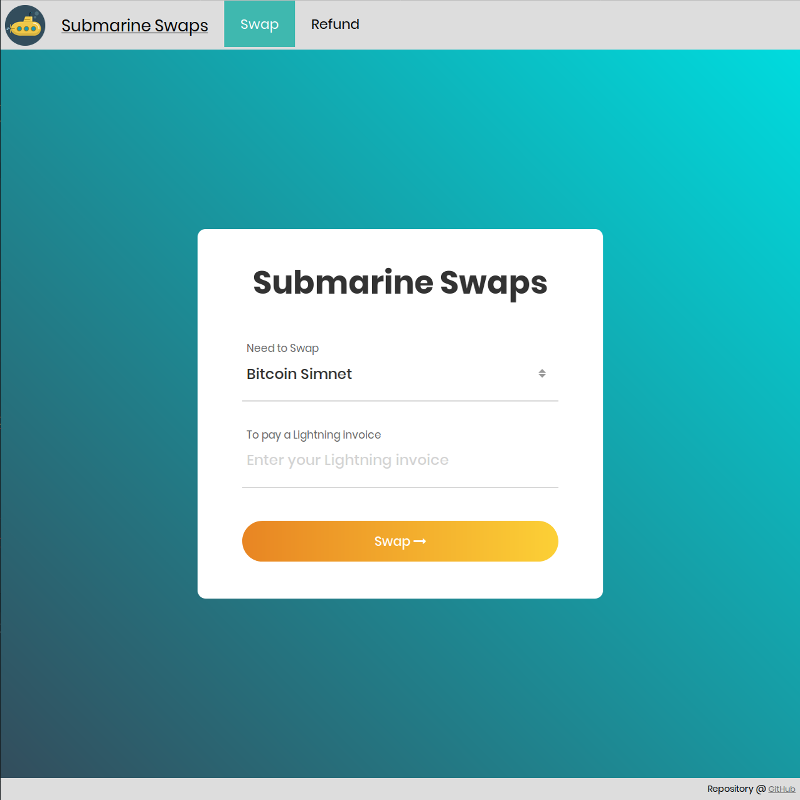

# Creating A Submarine Swaps Broker Platform
> This repository builds step-by-step a Submarine Swaps Broker Platform in Golang.

With this repository you can build a broker platform as a web application for Submarine Swaps. It allows swapping of on-chain bitcoins to off-chain payments without trust in the middleman called a broker. The inspiration to this application came from the [/submarineswaps/swaps-service](https://github.com/submarineswaps/swaps-service) repository written in Javascript by Alex Bosworth.

You can follow along each step by reading through the articles found inside [/docs/articles](docs/articles) or at my blog [https://bjarnemagnussen.netlify.com](https://bjarnemagnussen.netlify.com/tags/subswap.dev/).

Towards the end of this article series the broker platform will look a bit like:

## Disclaimer

**I have developed this project to the best of my knowledge. But I am no expert in web development and there may be mistakes and ways to optimize and better organize this code. It is only intended as an educational resource.**

## Improvements

There are many things that can be improved, some of which are mentioned as _possible improvements_ inside the articles. Pull requests on the project's repository are very welcome!

## Meta

Distributed under the MIT license. See ``LICENSE`` for more information.
