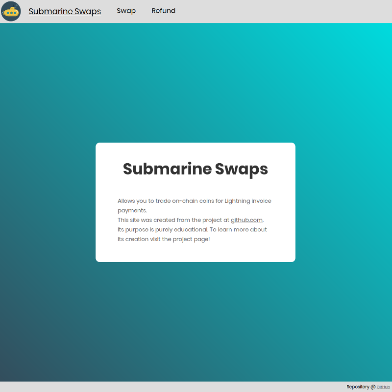

# Creating A Broker For Submarine Swaps Part 1: Introducing the Web Application

In this part we will look at how the web application for the Submarine Swaps broker platform is structured and programmed in Golang. This will hopefully demonstrate how numerous parts of the codebase link together and will allow for a better understanding of the different ways the external Bitcoin and the Lightning Network libraries will be interacting with each other.

# Introduction

We will build the platform for Submarine Swaps as a web application. It will enable swapping on-chain bitcoins to off-chain payments without trust in the middleman called a broker. See the [Prelude: Creating A Broker For Submarine Swaps]() to this article series for a short overview and some definitions. The inspiration to this application came from the [`/submarineswaps/swaps-service`][4] repository written in Javascript by Alex Bosworth.

Towards the end of this article series the broker platform will look a bit like:

![screenshot][images/screen.png]

The development of the platform will start off with very limited functionality only serving static pages using Golang's `html/template` package. With each part of the article series we build the platform up step-by-step. We will enable users to submit Lightning invoices, decoding them on the web server and generate a Bitcoin deposit address incorporating a Submarine Swap contract. After receiving and confirming funds to this address the application will pay the invoice and transfer the bitcoins to an address under the sole control of the broker. The user can check each step in the process by interacting with the broker platform.

In this first part we won't go into too many details regarding the code, as most of it should be quite self-explanatory. If you find it difficult to follow, please take a look at the prerequisites below.

# Disclaimer

**I have developed this project to the best of my knowledge. But I am no expert in web development and there may be mistakes and ways to optimize and better organize this code. It is only intended as an educational resource. Pull requests on the project's [repository](https://github.com/bjarnemagnussen/go-submarine-swaps) are very welcome!**

# Prerequisites

Throughout this article series when working with Golang we will mostly use its standard library. Later we will also import packages to communicate with the Bitcoin and Lightning network and communicate with a database.

**Requirements:**

- Go >= v1.10

You should be able to easily follow along if you are familiar with Golang and its `net/http` package and setting up handler functions using `HandlerFunc`. Otherwise, since the basics won't be covered I suggest to brush up on them before moving on. But it should hopefully not be too difficult to follow along, even if you’re fairly new.

**Suggestions to read up on:**

- Go's [`net/http`](https://golang.org/pkg/net/http/) package, e.g. [Golang article](https://golang.org/doc/articles/wiki/), [gowebexamples.com](https://gowebexamples.com/http-server/), or [Let's Go](https://lets-go.alexedwards.net/) by Alex Edwards.

**Optionally:**

- Go's [`html/template`](https://golang.org/pkg/html/template/) package, see also [Golang article](https://golang.org/doc/articles/wiki/#tmp_6)

# References

I have been using the book [Let's Go][1] by Alex Edwards and [Gophercises][2] by Jon Calhoun to get a rudimentary background in Golang web application programming. Jon Calhoun also offers a wonderful course called [Web Development with Go][3].

# Project Repository

The project code can be found at its repository https://github.com/bjarnemagnussen/go-submarine-swaps on Github and has a separate branch for each part of the article series.

You can clone or download a starting point for the project here https://github.com/bjarnemagnussen/go-submarine-swaps/tree/part-1:

```bash
git clone https://github.com/bjarnemagnussen/go-submarine-swaps.git
git fetch && git fetch --tags
git checkout part-1
```

# The Stack

Everything is kept to a bare minimum to allow a clear focus on the Bitcoin and Lightning Network integration.

**Backend:**
For the Backend we will mostly use Go's standard library. To later use the Bitcoin and Lighting Network and to connect to a database we will also import their appropriate packages.

**Frontend:**
We will only discuss the Frontend when necessary with minimal effort. Included with the project comes CSS and Javascript files to make the site look more nice and be responsive. But we won't go discuss them in detail. We will take a small peek at the HTML code and Go's templating system, while everything will be focused around the connection to the Backend.

# Project Structure and Organization


This project has been structured following _Peter Bourgon_'s repository structuring [guidelines](https://peter.bourgon.org/go-best-practices-2016/#repository-structure) and is kept very simple to allow for a clear focus on important details.

```
go-submarine-swaps
│
└───cmd
│   └───web
│       │   ...
│   
└───pkg
|   |   ...
|
└───ui
    └───html
    |   |   ...
    |
    └───static
        |   ...
```

Each of the directories found in the project folder is used for the following:

- The `cmd` directory will contain the application-specific code for the executable applications in the project. For now we will have just one executable application, the web application, which will live under the `cmd/web` directory.
- The `pkg` directory will contain the ancillary non-application-specific code used in the project. We will use it to hold potentially reusable code like validation helpers and the NoSQL database models for the project.
- The `ui` directory will contain the user-interface assets used by the web application. Specifically, the `ui/html` directory will contain HTML templates, and the `ui/static` directory will contain static files (like CSS and images).

# The Web Server

Through out the article series we will only make use of Golang's built-in server functionality. We won't cover details regarding production of the web server, such as integration with e.g. nginx and load balancing and only use the web server in development.

With that in mind let's start by producing code to setup the web server!

## Handler Dependencies

To inject dependencies into our potential handlers we will start by defining a custom structure type called `application`. It is declared and initialized as `app` inside `cmd/web/main.go` with fields holding pointers for the error and info logger. The handler functions will be defined as methods against it.

The routes, which will be explored in the next section, are isolated and contained inside the `app.routes()` method. Those routes are referenced as the handlers for the web server initiated as `srv` using Golang's [`http.Server`](https://godoc.org/net/http#Server) structure.

The web server is started on port 8080, but a custom port number can also be provided with the command-line. See the repository's [`docs/setup`](https://github.com/bjarnemagnussen/go-submarine-swaps/tree/part1/docs/setup) for further guidance on starting the server.

**File: `cmd/web/main.go`**
```golang
package main

import (
  "flag"
  "fmt"
  "log"
  "net/http"
  "os"
)

// Define an application struct to hold the application-wide dependencies for the
// web application. For now we'll only include fields for the two custom loggers, but
// we'll add more to it as the build progresses.
type application struct {
  errorLog *log.Logger
  infoLog  *log.Logger
}

func main() {
  // Define a new command-line flag with the name 'port' with a default value of "8080"
  port := flag.Int("port", 8080, "HTTP network address")
  flag.Parse()

  // Use log.New() to create a logger for writing information messages.
  infoLog := log.New(os.Stdout, "INFO\t", log.Ldate|log.Ltime)
  errorLog := log.New(os.Stderr, "ERROR\t", log.Ldate|log.Ltime|log.Lshortfile)

  // Initialize a new instance of application containing the dependencies.
  app := application{
    errorLog: errorLog,
    infoLog:  infoLog,
  }

  // Initialize a http.Server struct.
  srv := &http.Server{
    Addr:     fmt.Sprintf(":%d", *port),
    ErrorLog: errorLog,
    Handler:  app.routes(),
  }

  // Write messages using the two loggers, instead of the standard logger.
  infoLog.Printf("Starting server on %d", *port)
  err := srv.ListenAndServe()
  errorLog.Fatal(err)
}
```

The responsibilities of the `main()` function are limited to:

- Parsing the runtime configuration settings for the application,
- establishing the dependencies for the handlers, and
- running the HTTP server.

## Routing Requests

The Submarine Swaps application will only need four routes:

| Method | URL Pattern   | Handler      | Action                                                |
|--------|---------------|--------------|-------------------------------------------------------|
| GET    | /             | `home`       | Display the homepage                                  |
| GET    | /swap         | `swap`       | Show the form to create a new Submarine Swap request or display a specific Submarine Swap request |
| POST   | /swap         | `swap`       | Create a new Submarine Swap                           |
| GET    | /refund       | `refund`     | Refund a failed Sumbarine Swap                        |

As discussed above the routes are defined in the `routes()` method on the application structure and can be found inside `cmd/web/routes.go`. We also add a handler that serves the static files from the `ui` folder.

**File: `cmd/web/routes.go`**
```golang
package main

import "net/http"

func (app *application) routes() *http.ServeMux {
  // Register the handler functions and corresponding URL patterns with the servemux.
  mux := http.NewServeMux()
  mux.HandleFunc("/", app.home)
  mux.HandleFunc("/swap", app.swap)
  mux.HandleFunc("/refund", app.refund)

  // Create a file server which serves files out of the "./ui/static" directory.
  fileServer := http.FileServer(http.Dir("./ui/static/"))

  // Use the mux.Handle() function to register the file server as the handler for
  // all URL paths that start with "/static/". For matching paths, we strip the
  // "/static" prefix before the request reaches the file server.
  mux.Handle("/static/", http.StripPrefix("/static", fileServer))

  return mux
}
```

## Helper functions

Before we dig deeper into the handler functions, take a brief look at the error handling code inside helper methods.

**File: `cmd/web/helpers.go`**
```golang
package main

import (
  "fmt"
  "net/http"
  "runtime/debug"
)

// The serverError helper writes an error message and stack trace to the errorLog,
// then sends a generic 500 Internal Server Error response to the user.
func (app *application) serverError(w http.ResponseWriter, err error) {
  trace := fmt.Sprintf("%s\n%s", err.Error(), debug.Stack())
  app.errorLog.Output(2, trace)
  http.Error(w, http.StatusText(http.StatusInternalServerError), http.StatusInternalServerError)
}

// The clientError helper sends a specific status code and corresponding description
// to the user. We'll use this later in the book to send responses like 400 "Bad
// Request" when there's a problem with the request that the user sent.
func (app *application) clientError(w http.ResponseWriter, status int) {
  http.Error(w, http.StatusText(status), status)
}

// For consistency, we'll also implement a notFound helper. This is simply a
// convenience wrapper around clientError which sends a 404 Not Found response to
// the user.
func (app *application) notFound(w http.ResponseWriter) {
  app.clientError(w, http.StatusNotFound)
}
```

In the `serverError()` helper we use the `debug.Stack()` function to get a stack trace for the current goroutine and append it to the log message. Being able to see the execution path of the application via the stack trace can be helpful when you’re trying to debug errors.

In the `clientError()` helper we use the `http.StatusText()` function to automatically generate a human-friendly text representation of a given HTTP status code. For example, `http.StatusText(400)` will return the string "Bad Request".

## The Handlers

Finally let's take a look at the three handlers found inside `cmd/web/handlers.go`, which will be the only handlers used throughout this project.

**File: `cmd/web/handlers.go`**
```golang
package main

import (
  "fmt"
  "net/http"
  "strconv"
  "text/template"
)

func (app *application) home(w http.ResponseWriter, r *http.Request) {
  // Check if the current request URL path exactly matches "/". If it doesn't, use
  // the http.NotFound() function to send a 404 response to the client.
  if r.URL.Path != "/" {
    app.notFound(w)
    return
  }

  // Initialize a slice containing the paths to the two files. Note that the
  // home.page.tmpl file must be the *first* file in the slice.
  files := []string{
    "./ui/html/home.page.tmpl",
    "./ui/html/base.layout.tmpl",
    "./ui/html/footer.partial.tmpl",
  }

  // Use the template.ParseFiles() function to read the files and store the
  // templates in a template set. Notice that we can pass the slice of file paths
  // as a variadic parameter?
  ts, err := template.ParseFiles(files...)
  if err != nil {
    app.serverError(w, err)
    return
  }

  // We then use the Execute() method on the template set to write the template
  // content as the response body. The last parameter to Execute() represents any
  // dynamic data that we want to pass in, which for now we'll leave as nil.
  err = ts.Execute(w, nil)
  if err != nil {
    app.serverError(w, err)
    return
  }
}

func (app *application) refund(w http.ResponseWriter, r *http.Request) {
  id, err := strconv.Atoi(r.URL.Query().Get("id"))
  if err != nil || id < 1 {
    app.notFound(w) // Use the notFound() helper.
    return
  }
  w.Write([]byte("Getting a refund..."))
}

func (app *application) swap(w http.ResponseWriter, r *http.Request) {
  // Use r.Method to check whether the request is using POST or not.
  if r.Method == "POST" {
    return

  } else if r.Method == "GET" { // Use r.Method to check whether the request is using GET or not.
		w.Write([]byte("Nothing to see on the swap page yet!"))
  }
}
```

Currently those handlers don't do much. Only the `home()` handler renders the main page using Go's `html/template` with some text and no functionality. The other handlers are place-holders for future implementation.

When running the web application, the main page should be served and look like this:



## HTML Templates

The `ui/` directory contains the templates for serving the HTML pages. They are currently only being served by the `home` handler above.

A> **_Note:_** The naming convention of the template files is `<name>.<role>.tmpl`, where `<role>` is either `page`, `partial` or `layout`.

In the future we will develop the templates to render the form for submitting Lightning invoices and pages to present a Bitcoin deposit address, as well as get status updates on the swap request.

# Conclusion

*This concludes the first part and should have provided a rough overview of the web application. In Part 2: Decoding Lightning Invoices we will add functionality to submit Lightning invoices and decode them.*

# Sources

*The source for creating the HTML files was the [Contact Form v4](https://colorlib.com/wp/template/contact-form-v4/) template by colorlib. The little submarine favicon is from [free-icon-rainbow.com](http://free-icon-rainbow.com/submarine-free-icon-2/). The yellow submarine logo is from [Flat Icons](https://flat-icons.com/downloads/22-free-flat-icons/).*


[1]: https://lets-go.alexedwards.net/
[2]: https://gophercises.com/
[3]: https://www.usegolang.com/
[4]: https://github.com/submarineswaps/swaps-service
[5]: PRELUDE.md
[6]: https://github.com/ofek/bit
