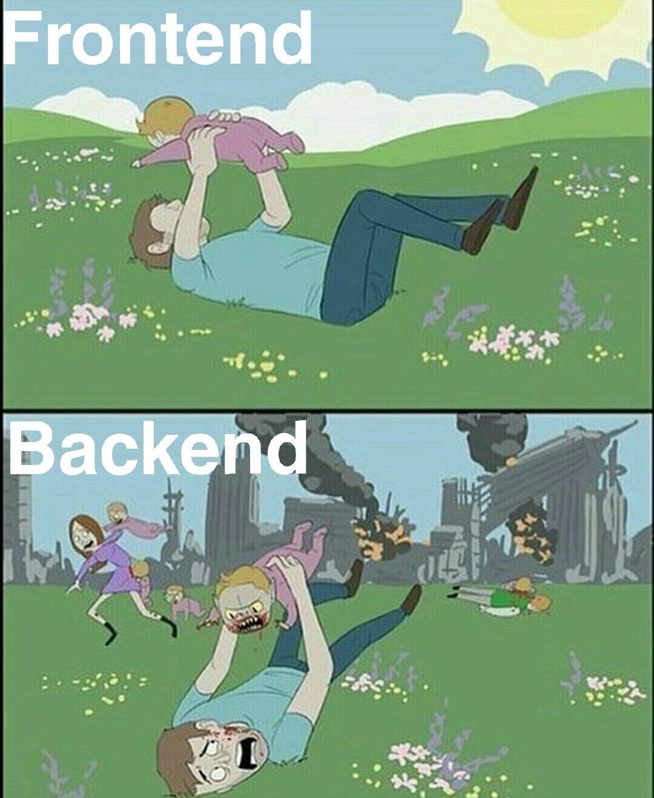

# Creating A Broker For Submarine Swaps Part 2: Decoding Lightning Invoices

In Part 1: Introducing the Web Application we looked at how the webserver was setup as text-book example and not specific to building the broker for submarine swaps. We will optimize the webserver in a later article.

In this part of the article series however we will get our hands dirty working directly with Lightning invoices. We will look at how they are encoded and make a Golang helper package to decode invoices into its many parts they are made up of.

# Disclaimer

**I have developed this project to the best of my knowledge. But I am no expert in web development and there may be mistakes and ways to optimize and better organize this code. It is only intended as an educational resource. Pull requests on the project's [repository](https://github.com/bjarnemagnussen/) are very welcome!**

# Prerequisites

Throughout this article series we will mostly use Golang's standard library. We will also import packages to communicate with the Bitcoin and Lightning network and later to communicate with a database.

**Requirements:**

- Go >= v1.10

If you are familiar with Bitcoin and the Lightning Network and how they work on a technical level, then you should be able to easily follow along. Otherwise, since the basics won't be covered I suggest to brush up on those topics before moving on. But it should hopefully not be too difficult to follow along, even if you’re fairly new.

**Suggestions to read up on:**

- [Hash functions](https://en.wikipedia.org/wiki/Hash_function).
- Generally about [public key cryptography](https://en.wikipedia.org/wiki/Public-key_cryptography) and its [digital signatures](https://en.wikipedia.org/wiki/Digital_signature).
- Some knowledge of the [Lightning Network](https://coincenter.org/entry/what-is-the-lightning-network).

**Optionally:**

- Go's [`html/template`](https://golang.org/pkg/html/template/) package, see [Golang article](https://golang.org/doc/articles/wiki/#tmp_6)


# Project Repository

The code can be found at its project repository on [Github](https://github.com/bjarnemagnussen/go-submarine-swaps). Each part of the article series has its separate branch.

You can clone or download a starting point for the project here https://github.com/bjarnemagnussen/go-submarine-swaps/tree/part-2:

```bash
git clone https://github.com/bjarnemagnussen/go-submarine-swaps.git
git fetch && git fetch --tags
git checkout part-2
```


# Lightning Invoice Data (BOLT-11)

The Lightning Network is technically specified inside documents called _Basis Of Lightning Technology_ (BOLTs). BOLTs are the common standard enabling distinct, interoperable Lightning implementations. The encoding of a Lightning invoice is specified in [BOLT-11](https://github.com/lightningnetwork/lightning-rfc/blob/master/11-payment-encoding.md).


## Human-Readable-Part

A Lightning invoice uses [bech32 encoding](https://github.com/bitcoin/bips/blob/master/bip-0173.mediawiki), which is also used for Bitcoin Segwit but is allowed to exceed the 90-character limit imposed in BIP-173.

It consists of a human-readable-part (HRP) made up of two parts:

1. a `prefix`: consisting of `ln` + BIP-173 currency prefix (e.g. `bc` for Bitcoin, `tb` for testnet-Bitcoin and `ltc` for Litecoin)
2. an `amount`: optional number, followed by an optional multiplier letter such as `m` for milli-satoshis.

> **Note:** The sole BIP-173 currency prefix is the HRP for the Bech32 Segwit address format (addresses starting with `bc1...`).


## Data Part

The data part of a Lightning invoice consists of multiple sections:

- a `timestamp`: Unix timestamp of seconds-since-1970 (35 bits, big-endian) denoting the invoice creation time,
- zero or more tagged fields, and
- a `signature`: Bitcoin-style signature of above (520 bits).

The receiver of a Lightning invoice is recognized by its public key and the `signature` must be calculated from its corresponding private key.


## Tagged Fields

There are two required fields that must be part of a Lightning invoice:

- a `description`, or a purpose of payment, and
- a 256-bit SHA256 `payment hash`. The preimage provides proof of payment.

Further, there are optional fields such as:

- an `expiry` of the invoice, which will be assumed to be 3600 seconds if not explicitly set,
- a fall-back for on-chain `address`, and
- a `public key` of the receiver matching the `signature`.

> **Note:** The `public key` tag is *optional* because it is possible to recover the receiver public key given the invoice and mandatory signature.

## Payment Hash

The payment hash is of utter importance and what makes Submarine Swaps possible. Briefly, a Lightning invoice is the payment for the preimage of that hash value. For more details see Rusty Russel's blog post on [Hashed Timelock Contracts (HTLCs)](https://rusty.ozlabs.org/?p=462).

In Part 3: Making Submarine Swaps the payment hash will be incorporated into the deposit addresses so that knowledge of this preimage unlocks the bitcoins from that address.


# Test Environment


Apart from the "_real_" Bitcoin there also exists a test environment for Bitcoin called _testnet_. This network also exists as a distributed network on the internet but with a difficulty that is automatically reset to 1 if no block is mined within the last 20 minutes. Although bitcoins on testnet therefore do not hold any monetary value, its mining difficulty can increase dramatically and due to its own policies can become unreliable.

For the purpose of developing the broker platform, the peer-to-peer network of Bitcoin is irrelevant. It therefore suffices to have a *local* and *private* Bitcoin network to play with. [Lightning Labs](https://lightning.engineering/), which is the company behind the development of the Lightning Network implementation `lnd` that we will be using, has developed tools to create such a network called _simnet_. It is very similar to the [_regtest_](https://bitcoin.org/en/developer-examples#regtest-mode) network that comes with Bitcoin Core.

The simnet network is a completely private and local version of a blockchain with minimal difficulty for mining. Throughout the development we will be using this environment to test the generation of addresses and sending and receiving Lightning invoices locally on our machine.

## Code Testing

> We won't cover code testing of our application.

I think it is extremely important to constantly test code and its integrity throughout development. But for this article series it would distract from the focus of integrating Bitcoin and the Lightning Network.

# Designing A Package To Decode Invoices

To work with Lightning invoices we will develop a package containing the necessary tools and functions. We will name this package `payreq` and it will live inside the `pkg/payreq` directory. The name was chosen since e.g. invoice is too generic and payreq is short for _pay_-ment _req_-uest, which Sumbarine Swaps are in general terms. It also allows extension with more general functions if the need arises. The package makes use of external packages from [`lnd`](https://godoc.org/github.com/lightningnetwork/lnd) and [`btcd`](https://godoc.org/github.com/btcsuite/btcd) to help us decode invoices. Let's look at the import statements.

**File: `pkg/payreq/decodepaymentrequest.go`**
```golang
package payreq

import (
  "encoding/hex"
  "fmt"
  "strings"
  "time"

  "github.com/btcsuite/btcd/chaincfg"
  "github.com/lightningnetwork/lnd/zpay32"
)
```

If you do not have an IDE that automatically takes care of downloading packages for you, make sure you get them:

```bash
go get -u github.com/btcsuite/btcd/chaincfg
go get -u github.com/lightningnetwork/lnd/zpay32
```

The imported modules will later be explained when being used. But for now let's continue with the implementation.

## Payment Requests

To decode an invoice we will need a type to convert it to. The custom type for a payment request will be called `PayReq` and we will convert a Lightning invoice to it during decoding. The `PayReq` structure contains fields relevant for Submarine Swaps and we will have to choose types for the fields that work best for us. The structure should follow immediately from the description of [Lightning invoice data](#lightning-invoice-data-bolt11).

**File: `pkg/payreq/decodepaymentrequest.go`**
```golang
// PayReq is a type representing a swap payment request.
type PayReq struct {
  Invoice            string
  Destination        string
  CreatedAt          time.Time
  Expiry             time.Duration
  Amount             uint64
  Description        string
  PaymentHash        []byte
}
```

I always find it difficult to settle on the concrete types used for Bitcoin and Lightning data fields. Let's see why in the following example:

The field `Destination` is of type `string` and represents the receiver of a Lightning invoice. Recall that it is given by the receiver's public key. The field is therefore expected to hold the key in [_base16 hex encoding_](https://en.wikipedia.org/wiki/Hexadecimal#Base16_(Transfer_encoding)). In Part 3: Making Submarine Swaps we will see how we check if a Lightning route to the receiver exists by calling a method that expects the public key to be in exactly that encoding.

However, for calculations that use the public key to e.g. compute its Bitcoin address the byte representation is often needed. This quickly leads to _messy_ code as the same data must be converted from one type to another depending on what it is used for.


Luckily for us though, we only need the key for one purpose and will therefore once and for all convert it to a string when decoding the invoice.

Looking closely, we see that the field `PaymentHash` is of type `[]byte`. This is the "magical value" that makes Submarine Swaps possible. And just as for the public key, the hash value could be represented as a string in hex. But we will only ever need it as byte value in computing the deposit address and therefore won't bother with the conversion.

_We are now ready for..._


## :drum: Drumroll... Decoding Invoices!

Naturally, the `payreq` package must also have functions to decode Lightning invoices. We define an exported function named `DecodeInvoice`, which given a Lightning invoice returns its `PayReq` structure. This function contains no logic itself and instead makes use of two function calls defined further below.

**File: `pkg/payreq/decodepaymentrequest.go`**
```golang
// DecodeInvoice will return a PayReq given a Lightning network Bolt11 invoice.
func DecodeInvoice(bolt11 string) (PayReq, error) {
  c, err := GetCurrencyFromInvoice(bolt11)
  if err != nil {
    return PayReq{}, err
  }

  return decodeInvoiceWithCurrency(c, bolt11)
}
```

The first call is to `GetCurrencyFromInvoice`. It returns the prefix Bech32 HRP of the currency for the Lightning invoice. Recall that this value is the part in the invoice after `ln` and before the amount is encountered, e.g. `bc` for Bitcoin and `tb` for Bitcoin testnet.

**File: `pkg/payreq/decodepaymentrequest.go`**
```golang
// GetCurrencyFromInvoice returns the Bech32 HRP of a Lightning network Bolt11
// invoice without validating the checksum of the invoice.
func GetCurrencyFromInvoice(bolt11 string) (string, error) {
  // Check that the invoice field is not blank.
  if strings.TrimSpace(bolt11) == "" {
    return "", fmt.Errorf("Lightning invoice is required")
  }

  // The Bech32 human-readable part for the currency is everything after the
  // first 'ln' until the first '1'.
  one := strings.IndexByte(bolt11, '1')
  if one < 3 || one+7 > len(bolt11) {
    return "", fmt.Errorf("Invalid index of 1")
  }
  hrp := bolt11[2:one]

	// Treat anything inside the HRP up to a digit as the currency prefix.
	amntIdx := strings.IndexFunc(hrp+"0", func(c rune) bool {
		return unicode.IsDigit(c)
	})

  return hrp[:amntIdx], nil
}
```

It first checks if the provided invoice is empty and returns an error in that case. Otherwise it finds the invoice HRP and the currency prefix is extracted from it. Anything before a digit is considered the prefix, and we add a `"0"` to the HRP when checking for digits to treat the whole HRP as the currency prefix in case no amount was specified.

Following up on `DecodeInvoice`, the Bech32 HRP value and the invoice are used as arguments to call a function `decodeInvoiceWithCurrency`. Inside this the "*real*" decoding takes place!

**File: `pkg/payreq/decodepaymentrequest.go`**
```golang
// decodeInvoiceWithCurrency decodes a Lightning network Bolt11 invoice to a PayReq
// using a provided cryptocurrency.
func decodeInvoiceWithCurrency(c string, bolt11 string) (PayReq, error) {
  inv, err := zpay32.Decode(bolt11, &chaincfg.Params{Bech32HRPSegwit: c})
  if err != nil {
    return PayReq{}, fmt.Errorf("Problem decoding invoice")
  }

  if time.Since(inv.Timestamp.Add(inv.Expiry())) >= 0 {
    return PayReq{}, fmt.Errorf("Invoice has already expired")
  }

  var sats uint64
  if inv.MilliSat != nil {
    sats = uint64(*inv.MilliSat) / 1000
  }

  var desc string
  if inv.Description != nil {
    desc = *inv.Description
  }

  return PayReq{
    Invoice:     bolt11,
    Destination: hex.EncodeToString(inv.Destination.SerializeCompressed()),
    CreatedAt:   inv.Timestamp,
    Expiry:      inv.Expiry(),
    Amount:      sats,
    Description: desc,
    PaymentHash: inv.PaymentHash[:],
  }, nil
}
```

The `decodeInvoiceWithCurrency` function is basically a wrapper for [`zpay32.Decode`](https://godoc.org/github.com/lightningnetwork/lnd/zpay32#Decode). It requires the Bech32 HRP encapsulated in an eerie looking pointer to a [`chaincfg.Params`](https://godoc.org/github.com/btcsuite/btcd/chaincfg#Params) structure.

The `chaincfg.Params` is a structure from the imported `btcd/chaincfg` package. It contains fields to define a cryptocurrency network by its parameters, such as the _network type_ (mainnet, testnet or simnet) and version bytes (_magics_) of addresses and keys. One of those fields is [`Bech32HRPSegwit`](https://github.com/btcsuite/btcd/blob/962a206e94e9151fe41bbd6d6464af4ba7168f50/chaincfg/params.go#L206). As the name suggests it defines the currency prefix for the Bech32 HRP of the network, which is the same value we just extracted from the invoice and passed on to this function call via the `chaincfg.Params` structure.

The `Bech32HRPSegwit` field is the only field that `zpay32.Decode` will use from the `chaincfg.Params` structure for decoding the invoice. We therefore initialize the structure with only this value.

The `zpay32.Decode` function then validates the invoice against the provided Bech32 HRP. If the currency and invoice match and the invoice is encoded properly with a correct checksum, then a [`zpay32.Invoice`](https://godoc.org/github.com/lightningnetwork/lnd/zpay32#Invoice) structure is returned. We use this `zpay32.Invoice` structure to convert to trimmed `PayReq` structure.

To that end we convert the public key in `zpay32.Invoice.Destination` from a [`btcec.PublicKey`](https://godoc.org/github.com/btcsuite/btcd/btcec#PublicKey) to its string representation using the key's [`SerializeCompressed`](https://godoc.org/github.com/btcsuite/btcd/btcec#PublicKey.SerializeCompressed) method. We will in a later article meet this public key structure again when calculating a deposit address. We also convert the amount in `zpay32.Invoice.MilliSat` from milli-satoshis to satoshis.

Further, we handle errors by giving them a general message when returned to the caller. We also immediately return any expired invoices as errors, since they cannot form valid payment requests anymore.

A benefit of using our own `PayReq` type is that even if `zpay32.Invoice` changes structure in the future, we only have to change the code in this one place for our entire application.


# Submitting An Invoice

We have gotten through the *hardest part* of this article series. What is left is some frontend work and it is therefore probably a good place to get a cup of :coffee: (or take a ***short(!?)*** break :sleeping:).

To ease your time little here is some developer humor...



We will now allow users to submit Lightning invoices by adding a form to our web application. The form is found inside `ui/static/html/form.partial.tmpl`. I won't cover all the details of the HTML code, which is based on the template [Contact Form v4](https://colorlib.com/wp/template/contact-form-v4/). For now the form has only one field: A text field to submit the Lightning invoice. Important to notice is that the data is submitted by `POST` to the `/swap` route that was already encountered in Part 1: Introducing the Web Application.

**File: `ui/static/html/form.partial.tmpl`**
```html
<form class="contact100-form validate-form" method="POST" action="/swap">
    ...
    <input class="input100" type="text" name="invoice" placeholder="Enter your Lightning invoice">
    ...
</form>
```

We create a new page template inside `ui/static/html/create.page.tmpl` adding our form with curly brackets notation "`{{template "form" .}}`".

**File: `ui/static/html/create.page.tmpl`**
```html
{{template "base" .}}

{{define "title"}}Swap{{end}}

{{define "body"}}
      <div class="container-contact100">
        <div class="wrap-contact100">
          <span class="contact100-form-title">
            Submarine Swaps
          </span>
            {{template "form" .}}
        </div>
      </div>
{{end}}
```

We then update the `swap` handler to render the create page when requesting the route via the `GET` method:

**File: `cmd/web/handlers.go`**
```golang
func (app *application) swap(w http.ResponseWriter, r *http.Request) {
  // Use r.Method to check whether the request is using POST or not.
  if r.Method == "POST" {
    ...
  } else if r.Method == "GET" { // Use r.Method to check whether the request is using GET or not.
    // Initialize a slice containing the paths to the two files. Note that the
    // home.page.tmpl file must be the *first* file in the slice.
    files := []string{
      "./ui/html/create.page.tmpl",
      "./ui/html/base.layout.tmpl",
      "./ui/html/topnav.partial.tmpl",
      "./ui/html/footer.partial.tmpl",
      "./ui/html/form.partial.tmpl",
    }

    // Use the template.ParseFiles() function to read the files and store the
    // templates in a template set. Notice that we can pass the slice of file paths
    // as a variadic parameter?
    ts, err := template.ParseFiles(files...)
    if err != nil {
      app.serverError(w, err)
      return
    }

    // We then use the Execute() method on the template set to write the template
    // content as the response body. The last parameter to Execute() represents any
    // dynamic data that we want to pass in, which for now we'll leave as nil.
    err = ts.Execute(w, nil)
    if err != nil {
      app.serverError(w, err)
    }
  }
}
```

Next up we will take care of the submitted invoice inside the handler's `POST` path.


## Processing Submitted Invoices

With a form to submit an invoice and the `payreq` package able to convert it to a `PayReq`, it's time to release a submitted invoice from nirvana :sparkles: and decode :1234: it!

At this point we will not do anything fancy with it. Inside the `POST` path of the `swap` handler we request the invoice data using Go's `http.ParseForm` function. We then make some light validation inside `payreq.DecodeInvoice` to assure any data posted is decodeable. The values of the `PayReq` structure are then just dumped as plain-text HTTP response. If any errors occurred we print them out to the console instead.

**File: `cmd/web/handlers.go`**

```golang
func (app *application) swap(w http.ResponseWriter, r *http.Request) {
  // Use r.Method to check whether the request is using POST or not.
  if r.Method == "POST" {
    // First we call r.ParseForm() which adds any data in POST request bodies
    // to the r.PostForm map. This also works in the same way for PUT and PATCH
    // requests. If there are any errors, we use our app.ClientError helper to send
    // a 400 Bad Request response to the user.
    err := r.ParseForm()
    if err != nil {
      app.clientError(w, http.StatusBadRequest)
      return
    }

    // Use the r.PostForm.Get() method to retrieve the relevant data fields
    // from the r.PostForm map.
    invoice := r.PostForm.Get("invoice")

    // Initialize a map to hold any validation errors.
    errors := make(map[string]string)

    // Decode Lightning Bolt11 invoice
    inv, err := payreq.DecodeInvoice(invoice)
    if err != nil && errors["invoice"] == "" {
      errors["invoice"] = err.Error()
    }

    // If there are any errors, dump them in a plain text HTTP response and return
    // from the handler.
    if len(errors) > 0 {
      fmt.Fprint(w, errors)
      return
    }

    // Dump the value content out in a plain-text HTTP response
    w.Write([]byte(fmt.Sprintf("invoice:\n%v\n\n", inv)))

  } else if r.Method == "GET" { // Use r.Method to check whether the request is using GET or not.
    ...
  }
}
```

Try to run the web server and play around with submitting invoices! See `docs/setup` on the [repository](https://github.com/bjarnemagnussen/submarine-swaps/tree/part-2/docs/setup) for further guidance.

## The Output Of A Submitted Invoice

Submitting a valid invoice should output plain-text looking something like this:

```
invoice:
{lnsb100u1pwsn6dwpp556m4zqu3lfr4207s57467t4zz0c4l0lgdrrwuej67ts6l38xcuqqdqqcqzpgawy36esfnlzpgdjkl8tj2ql9hsq520kh423834g2wedcf494dt2qch0d30j764eayhxrfpda2ew0uxtyvvjmga64p4nw6kr3ucc3vxspsd5ngs 02ac8defda34b6e442b8bff123fc945458a30eb0011ee2c7028a8a891843a9ef56 1560930734 3600 10000  [166 183 81 3 145 250 71 85 63 208 167 171 175 46 162 19 241 95 191 232 104 198 238 102 90 242 225 175 196 230 199 0]}
```

All the fields of the PayReq structure are printed out one-by-one. The first field is the _invoice_ itself, followed by the _destination's public key_, the UNIX timestamp of _creation_, the _expiry_ in seconds, the _amount_ in satoshis, an empty _description_, and last but not least the _payment hash_.

If the invoice was already expired however, you should see a warning:

```
map[invoice:Invoice has already expired]
```

Try to use a valid invoice and change *one or more* characters of it before submitting it. You should now see the following error message:
```
map[invoice:Problem decoding invoice]
```

# Conclusion

*This concludes the second part of the article series developing a package to decode Lightning invoices. In the upcoming Part 3: Making Submarine Swaps we will extend this package to create deposit addresses used for Submarine Swaps.*

# Possible Improvements

Our helper function `payreq.GetCurrencyFromInvoice` could be improved if it would also validate the Bech32 checksum of the invoice, as can be found inside [`zpay32.decodeBech32`](https://github.com/lightningnetwork/lnd/blob/f63c5d0170c33c2c86de2768ede15660a1fe0595/zpay32/bech32.go#L20). However, this is not really a problem as we let the application decode every invoice afterwards, which implicitly validates it.

Any bug-fixes or ideas for improvements are very welcome and don't hesitate to checkout the repository on [GitHub](https://github.com/bjarnemagnussen/go-submarine-swaps) to add an issue or pull request!


[1]: https://lets-go.alexedwards.net/
[2]: https://gophercises.com/
[3]: https://www.usegolang.com/
[4]: https://github.com/submarineswaps/swaps-service
[5]: PRELUDE.md
[6]: https://github.com/ofek/bit
